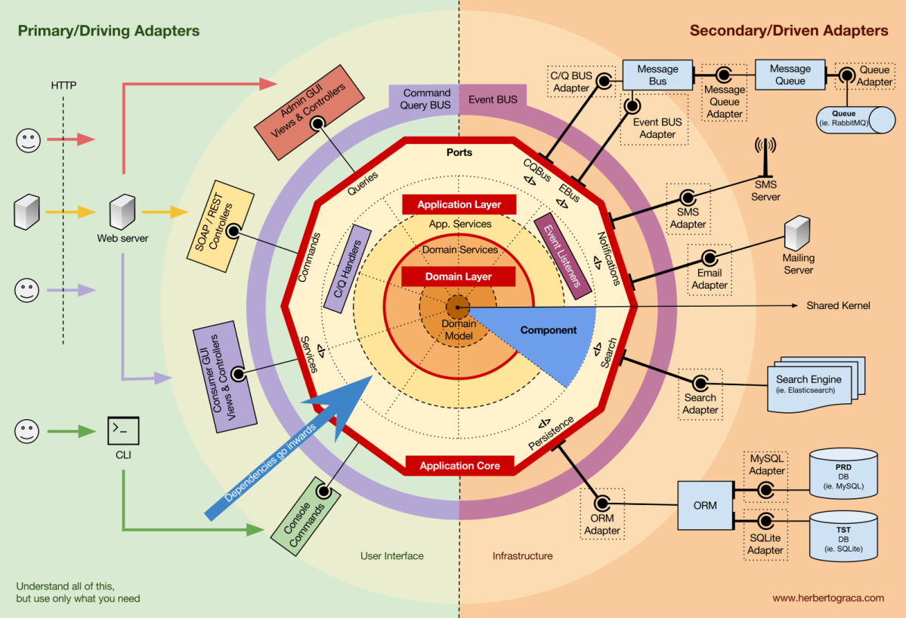
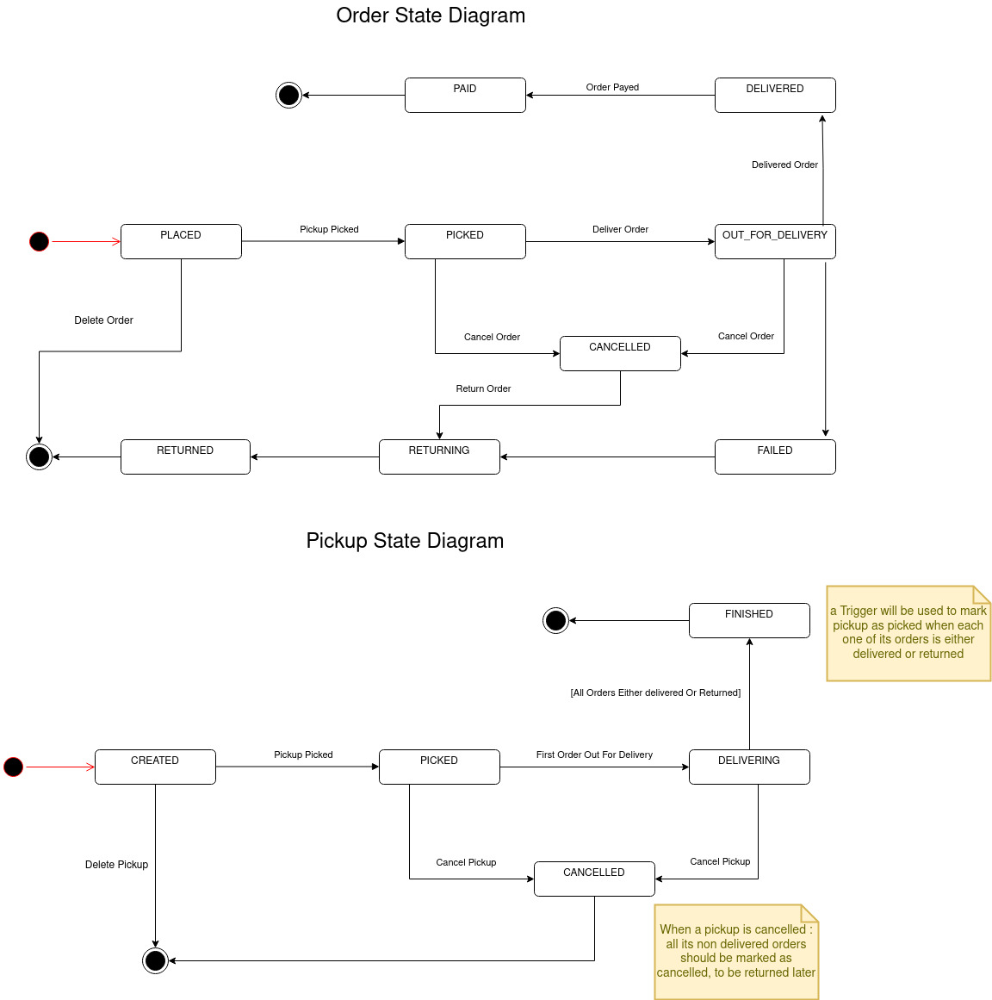

# Hexagonal Architecture :

this article explains the folder structure and the overall architecture :
[hgrace article about DDD and Hexagonal Architecture](https://herbertograca.com/2017/11/16/explicit-architecture-01-ddd-hexagonal-onion-clean-cqrs-how-i-put-it-all-together/)

# State Transission Diagrams :

